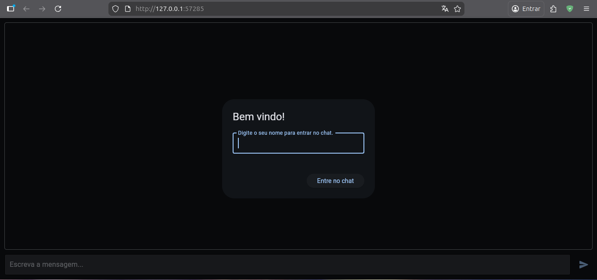
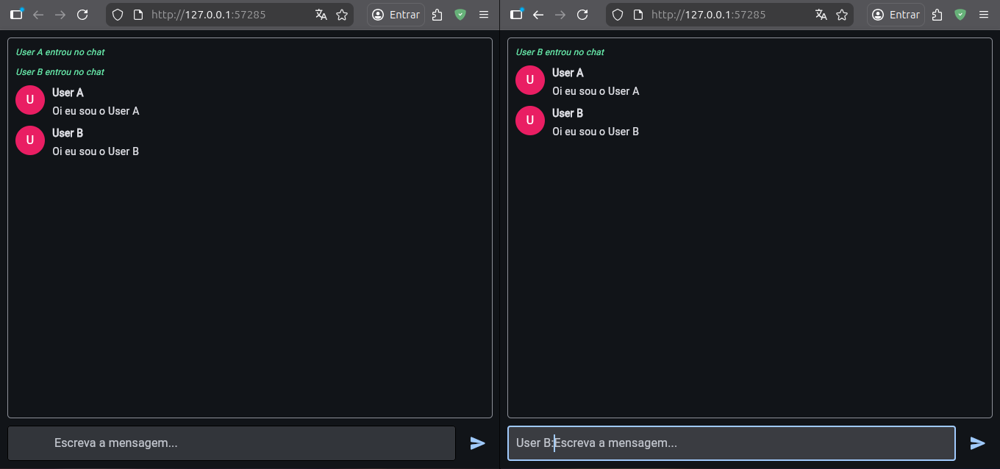

# Flet Chat

A real-time chat application built with Python and Flet, featuring a clean interface and instant messaging capabilities.

## 🚀 Technologies Used

- **Python**: The core programming language.
- **Flet**: A framework that allows building interactive multi-platform apps in Python.
- **Uvicorn/FastAPI**: Used under the hood by Flet for the web server capabilities.

## 📂 Project Structure

```text
project-python-flet-chat/
├── main.py              # Main application logic
├── requirements.txt     # Project dependencies
├── .gitignore          # Files ignored by Git
└── README.md           # Project documentation
```

## 🛠️ How to Run

### 1. Requirements

Ensure you have Python installed on your system.

### 2. Setup Virtual Environment (Recommended)

```bash
python -m venv .venv
source .venv/bin/activate  # Linux/macOS
# or
.venv\Scripts\activate     # Windows
```

### 3. Install Dependencies

```bash
pip install -r requirements.txt
```

### 4. Execute the Project

To run the project in web mode on a specific port:

```bash
flet run --web --port 57285 main.py
```

The application will be available locally at: [http://127.0.0.1:57285/](http://127.0.0.1:57285/)

### 👥 Testing Multi-User Chat

To test the real-time chat functionality:

1. Open [http://127.0.0.1:57285/](http://127.0.0.1:57285/) in your browser.
2. Open the same URL in **two or more different browser tabs or windows**.
3. Enter a different name in each tab and start chatting!

## 🖼️ Previews



